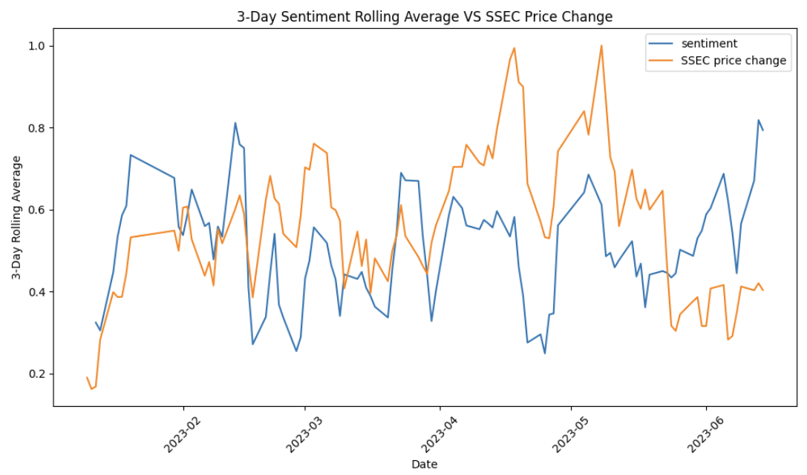
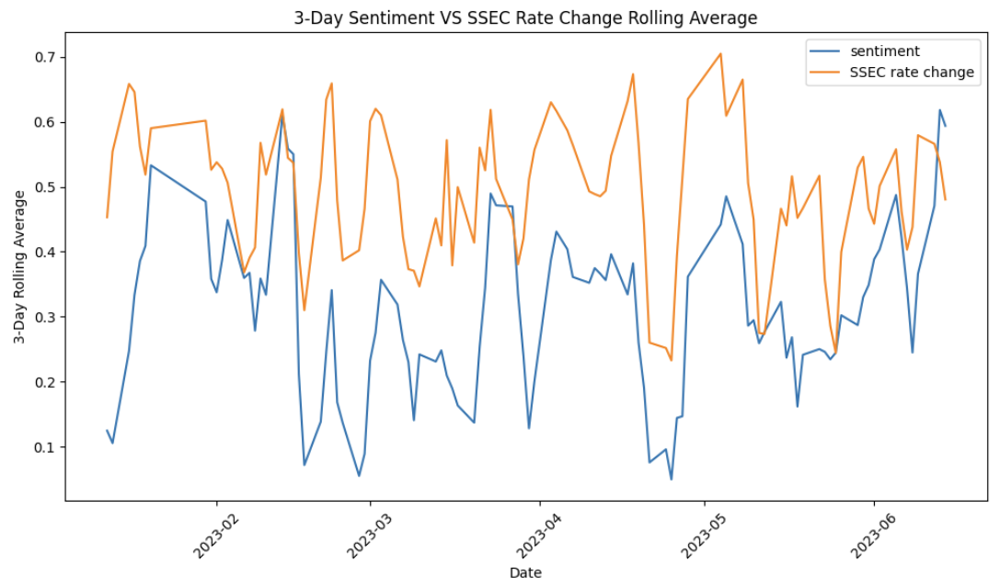

# Stock market sentiment analysis

## Overview and Objective
Sentiment analysis has become an increasingly valuable tool in understanding and predicting stock market trends. With the advent of social media and online platforms, individuals' opinions and emotions about various stocks and investment opportunities are readily available for analysis. This project aims to leverage sentiment analysis techniques to extract insights from large volumes of textual data and evaluate their relationship with Chinese stock market, using the Composite Index as an instance.

## Method
### Data
The textual data are latest comments(2023) collected from a stock forum; it has nearly 300,000 entries. The dataset is preprocessed with normalization and
[semantic decomposition](https://github.com/fxsjy/jieba) before feeding to the model, in order to cut the sentence accurately, suitable for text analysis.

### Model
The main model ```RoBERTa-wwm-ext-large```, which is introduced by the paper [Pre-Training With Whole Word Masking for Chinese BERT](https://arxiv.org/abs/1906.08101), is a variant of BERT, further fine-tuned on a self-labled financial dataset. It is directly accessible through [Transformer](https://github.com/huggingface/transformers). The model achieves about 0.96 in prediction accuracy after 3 epochs of fine-tuning. I also tried some other traditional machine learning algorithms, among which SVM and logistic regression present the best performance(around 0.89).

## Result
### Metric
The calculation of Bullishness Index is as below:
$$Index = \ln\left(\frac{{1 + M_{\text{bull}}}}{{1 + M_{\text{bear}}}}\right)$$
The purpose of this equation is to gauge the overall sentiment or bullishness in the market based on the relative number of bullish and bearish participants. The logarithm function helps compress the range of values and emphasize the significance of changes in sentiment.

### Graphs
<p align="center">

</p>
<p align="center">

</p>

The first graph shows the price of Shanghai Composite Index (SSEC) vs rolling average of previous 3-day sentiment. The second graph shows change rate of SSEC vs sentiment. Overall there seems to have a strong correlation between market sentiment and market price, but whether sentiment will be a valid predictive metric is uncertain.


### Future works:

Some further work might include:
  - **Larger training set**: a larger training set will certainly help the model understand financial comments better.
  - **Feature engineering**: assigning different weights to sentiment based on commentor's popularity(number of followers or reviews).
  - **Evaluation of semantic decomposition**: to what extent does it improve the text analysis.
  - ...
